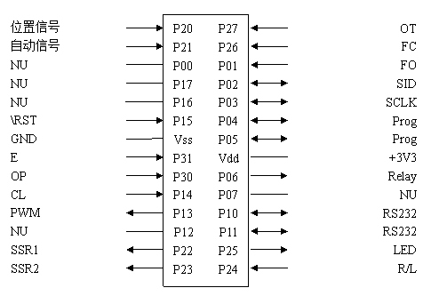
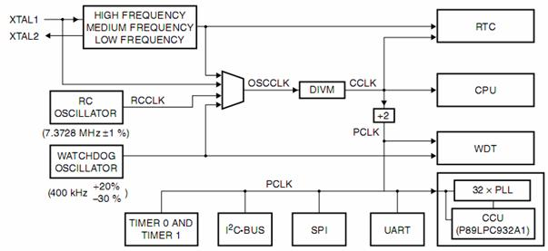
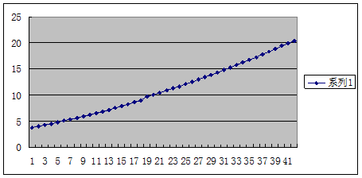
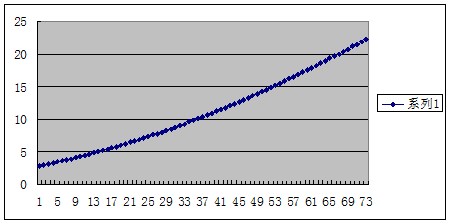

H45345(AF014H)软件设计，采用了和克隆的方法，软件程序的功能和原来的软件相同。硬件也采用了相同的电路；

**图一：  P89LPC938引脚定义**



**表一： P89LPC938引脚方向及功能**

|引脚|方向|功能|引脚|方向|功能|
|----|----|----|----|----|----|
|P00|*|NU|P01|I|FO-开限位|
|P02|IO|SID-LCD|P03|IO|SCLK-LCD|
|P04|IO|program|P05|IO|program|
|P06|O|Relay-故障输出|P07|*|NU|
|P10|O|TXD|P11|I|RXD|
|P12|*|NU|P13|O|PWM-位置信号输出4-20mA|
|P14|I|CL-关按钮|P15|I|RST|
|P16*|NU|P17| *|U|
|P20|A|位置信号输入-电位器|P21|A|自动信号输入4-20mA|
|P22|O|SSR1|P23|O|SSR2|
|P24|I|R/L-远程就地|P25|O|LED_LOCAL-就地显示|
|P26|I|FC-关限位|P27|I|OT-马达温度|
|P30|I|OP-开按钮|P31|I|E-确认按钮|

### MCU系统配置

系统时钟采用MCU内部RC振荡器（7.373MHz+/-1%）来产生。


**当前设置的各个时钟频率：**
* RCCLK - 7.373MHz
* CCLK  - 7.373MHz (DIVM=0)
* PCLK  - 3.6865MHz (CCLK/2) – 0.27126us



**OSCCLK**－输入到DIVM 分频器。OSCCLK 有4 个时钟源选项并且也可以分频为低频时钟。__注：__fosc 定义为OSCCLK频率  
**CCLK**－CPU 时钟；DIVM 时钟分频器的输出。每个机器周期包含2个CCLK 周期，大多数指令执行时间为1 到2 个机器周期（2 到4 个CCLK 周期）。  
**RCCLK**－内部7.373MHz RC 振荡器输出。  
**PCLK**－用于不同外围功能的时钟，为CCLK/2。

**DIVM 寄存器**  
OSCCLK 频率可通过整数倒分频，通过配置分频寄存器DIVM 进行高达510 分频来提供CCLK。从下式中可得出CCLK 的频率：  

> CCLK 频率＝fOSC/(2N)

此处，fOSC 为OSCCLK 频率。N 是DIVM 的值。  
由于N 的取值范围为0～255，因此，CCLK 的频率范围为fOSC～fOSC/510。(N=0时,CCLK=fOSC)。  

### 代码分析

#### MCU端口初始化

**表2 IO配置方法**

|PxM1.Y|PxM2.Y|口输出模式|
|------|------|----------|
|0|0|准双向口|
|0|1|推挽|
|1|0|仅为输入（高阻）|
|1|1|开漏|

**表3 P89LPC938引脚方向配置寄存器定义**

|   |HEX|7|6|5|4|3|2|1|0|
|---|---|---|---|---|---|---|---|---|---|
|||NU|Relay|prog|prog|SCLK|SID|FO|NU|
|P0||x|O|x|x|IO|IO|I|x|
|P0M1|B3|1|0|1|1|0|0|1|1|
|P0M2|0|0|0|0|0|0|0|0|0|
|||NU|NU|RST|CL|PWM|NU|RXD|TXD|
|P1||x|x|x|I|O|I|I|O|
|P1M1|F4|1|1|1|1|0|1|0|0|
|P1M2|8|0|0|0|0|1|0|0|0|
|||OT|FC|LED|R/L|SSR2|SSR1|A|A|
|P2||I|I|O|I|O|O|A|A|
|P2M1|D3|1|1|0|1|0|0|1|1|
|P2M2|0|0|0|0|0|0|0|0|0|
|||||||||E|OP|
|P3||||||||I|I|
|P3M1|3|||||||1|1|
|P3M2|0|||||||0|0|

**端口初始化代码**

```
void InitIO()
{
    // I/O initialization
    P0M1 = 0;
    P0M2 = 0;                      /* Set P0                                     */
    P1M1 = 0;
    P1M2 = 0x08;                   /* Set P1                                     */
	P2M1 = 0;
	P2M2 = 0;                      /* Set P2                                     */
	P3M1 = 0;
	P3M2 = 0;                      /* Set P3                                     */
}
```

#### 系统执行间隔时间10mS

系统执行间隔时间10mS，采用了MCU的定时器0中断程序来完成。定时器按照指定的时间间隔进行中断，这样来产生系统执行的间隔时间。

由于定时器中断时间比较长（10mS），定时器的时钟PCLK为3.6865MHz（0.27126uS），间隔10mS中断TH0、TL0寄存器数据为（10mS/0.27126uS=36865/__HEX9001__），TH0/TL0=0x6FFF。因而，定时器只能采用mode 1(__TnM[2:1]=001b__)，即16位的定时器寄存器来进行分频。

```
void InitTMR0()
{
                                   /* Timer 0 in mode 1, 16bit counter           */
    TL0 = 0xFF;
    TH0 = 0x6F;
    TMOD = (TMOD & 0xF0) | 0x01;   /* Set T/C0 Mode 1                            */
    ET0 = 1;                       /* Enable Timer 0 Interrupts                  */
    TR0 = 1;                       /* Start Timer 0 Running                      */
    EA = 1;                        /* Global Interrupt Enable                    */
}
```


**Timer/counter 0 or 1 in mode 1(16-bit counter).**

#### 外部开关信号采样程序

外部开关信号的采样，按照系统执行间隔时间来采样，系统执行一次，对外部开关信号采样一次，然后设定对应的标志寄存器。通过该程序可以检测到按钮的状态，例如：按下、弹起、按下时间、弹起时间、上升沿状态、下降沿状态等。

外部开关信号的采样间隔10mS采用一次，采样程序在定时器0的10mS中断程序中进行采样。

```
bit rl_st,rl_ud,rl_du;		// bits about remote/local
bit e_st,e_ud,e_du;			// bits about e key
bit op_st,op_ud,op_du;		// bits about open key
bit cl_st,cl_ud,cl_du;		// bits about close key
bit lt_st,lt_ud,lt_du;		    // bits about limit of temperature
bit lo_st,lo_ud,lo_du;		// bits about limit of open
bit lc_st,lc_ud,lc_du;		// bits about limit of close
unsigned int rl_time,e_time,op_time,cl_time,lt_time,lo_time,lc_time;
```
x_st - 按键状态标志位；  
x_ud – 按键下降沿标志位；  
x_du – 按键上升沿标志；  
x_time – 按键保持时间  


```
void KeySample()
{
	// key "RL" sample
	if(RL)
	{
		if(rl_st==LOW)
		{
			rl_time = 0;
			rl_du = TRUE;
		}

		rl_time ++;
		rl_st = HIGH;
	}		
	else
	{
		if(rl_st==HIGH)
		{
			rl_time = 0;
			rl_ud = TRUE;
		}

		rl_time++;
		rl_st = LOW;
	}
	// key "E" sample
	if(E)
	{
		if(e_st==LOW)
		{
			e_time = 0;
			e_du = TRUE;
		}

		e_time ++;
		e_st = HIGH;
	}		
	else
	{
		if(e_st==HIGH)
		{
			e_time = 0;
			e_ud = TRUE;
		}

		e_time++;
		e_st = LOW;
	}
	// key "OPEN" sample
	if(OPEN)
	{
		if(op_st==LOW)
		{
			op_time = 0;
			op_du = TRUE;
		}

		op_time ++;
		op_st = HIGH;
	}		
	else
	{
		if(op_st==HIGH)
		{
			op_time = 0;
			op_ud = TRUE;
		}

		op_time++;
		op_st = LOW;
	}
	// key "CLOSE" sample
	if(CLOSE)
	{
		if(cl_st==LOW)
		{
			cl_time = 0;
			cl_du = TRUE;
		}

		cl_time ++;
		cl_st = HIGH;
	}		
	else
	{
		if(cl_st==HIGH)
		{
			cl_time = 0;
			cl_ud = TRUE;
		}

		cl_time++;
		cl_st = LOW;
	}
	// key "LTEMP" sample
	if(LTEMP)
	{
		if(lt_st==LOW)
		{
			lt_time = 0;
			lt_du = TRUE;
		}

		lt_time ++;
		lt_st = HIGH;
	}		
	else
	{
		if(lt_st==HIGH)
		{
			lt_time = 0;
			lt_ud = TRUE;
		}

		lt_time++;
		lt_st = LOW;
	}
	// key "LOPEN" sample
	if(LOPEN)
	{
		if(lo_st==LOW)
		{
			lo_time = 0;
			lo_du = TRUE;
		}

		lo_time ++;
		lo_st = HIGH;
	}		
	else
	{
		if(lo_st==HIGH)
		{
			lo_time = 0;
			lo_ud = TRUE;
		}

		lo_time++;
		lo_st = LOW;
	}
	// key "LCLOSE" sample
	if(LCLOSE)
	{
		if(lc_st==LOW)
		{
			lc_time = 0;
			lc_du = TRUE;
		}

		lc_time ++;
		lc_st = HIGH;
	}		
	else
	{
		if(lc_st==HIGH)
		{
			lc_time = 0;
			lc_ud = TRUE;
		}

		lc_time++;
		lc_st = LOW;
	}
}
```

#### AD采样程序

ADC采样采用了双通道，连续转换模式进行；

```
void InitADC()
{
	ADMODA = 0x20;                 /* selects fixed and dual channel,
											  continuous conversion modes.       */
	ADMODB = 0x60;                 /* CLK: 1.5MHz for 12MHz XTAL                 */
    AD0INS = 0xC0;                 /* Enable AD06..AD07 inputs                   */
    AD0CON = 0x05;                 /* Enable+start A/D converter                 */
}
void ADCSample()
{
	unsigned int adc[5];
	unsigned char i;

	while((AD0CON&0x08)==0){}
    AD0CON &= 0xF7;

	// auto signal sample
	for(i=0;i<=4;i++) adc[i] = 0;

	adc[0] = (unsigned int)(AD0DAT0L*4)+(AD0DAT0R&0x03);
	adc[1] = (unsigned int)(AD0DAT2L*4)+(AD0DAT2R&0x03);
	adc[2] = (unsigned int)(AD0DAT4L*4)+(AD0DAT4R&0x03);
	adc[3] = (unsigned int)(AD0DAT6L*4)+(AD0DAT6R&0x03);
	for(i=0;i<4;i++)
	{
		adc[4] += adc[i];
	}
	adc_auto = adc[4]/4;
	// pot signal sample
	for(i=0;i<=4;i++) adc[i] = 0;

	adc[0] = (unsigned int)(AD0DAT1L*4)+(AD0DAT1R&0x03);
	adc[1] = (unsigned int)(AD0DAT3L*4)+(AD0DAT3R&0x03);
	adc[2] = (unsigned int)(AD0DAT5L*4)+(AD0DAT5R&0x03);
	adc[3] = (unsigned int)(AD0DAT7L*4)+(AD0DAT7R&0x03);
	for(i=0;i<4;i++)
	{
		adc[4] += adc[i];
	}
	adc_pot = adc[4]/4;
}
```

#### PWM控制程序

本设计采用PWM控制程序，用来输出一个PWM信号来实现DAC的功能；PWM实现方法有3种：一种是采用Timer/counter 0 或 1来实现PWM信号的产生；另一种方法采用CCU功能来实现。我们采用的是定时器方法来实现，输出引脚为P1.3；还有一种通过定时器中断产生固定的时钟频率，通过计数器来实现PWM的控制。

本设计的PWM要求频率为200Hz，控制精度200，最小单位25us变换一次；我们采用定时器2进行25uS中断，在终端程序内进行PWM输出脚的高低点平控制。

由于定时器中断时间为（25uS），定时器的时钟PCLK为3.6865MHz（0.27126uS），间隔10mS中断TH0、TL0寄存器数据为（25uS/0.27126uS=92.16/HEX5C），TH1=A4。因而，定时器可以采用mode 0(TnM[2:1]=010b)。


Timer/counter 0 or 1 in Mode 2(8-bit auto-reload)



PWM 400Hz频率占空比调整4-20mA



PWM 200Hz频率占空比调整4-20mA


PWM 100Hz频率占空比调整4-20mA


```
int PWMCounter;
int PWMData;

void InitTMR1(void)
{
	TH1 = 0xA4;					// 25uS intterrupt
	TMOD|=0x20;					// timer1 mode 6, PWM
	TR1 = 1;					// start timer 1
	ET1 = 1;					// Enable Timer 1 Interrupts
	EA  = 1;					// Global Interrupt Enable
}

/*------------------------------------------------
Timer 1 Interrupt Service Routine.
25uS intterupt onetime
------------------------------------------------*/
void timer1_ISR (void) interrupt 3
{
	TH1 = 0xA4;
	PWMCounter++;
	if(PWMCounter>400)PWMCounter=0;

	if(PWMCounter<PWMData)
		PWM = 0;
	else
		PWM = 1;
	//testport = !testport;
	XTMR ++;
}
```

#### UART程序

UART程序为程序的人机接口程序，我们可以通过该端口了解程序的运行情况。该应用程序通过初始化程序后，通过stdio.h头文件来调用相关的子程序。

```
void InitUart()
{
    SCON   = 0x52;              // initialize UART
	SSTAT  = 0x60;				// separate Rx / Tx interrupts
    BRGR0  = 0xF0;              // 9600 baud, 8 bit, no parity, 1 stop bit
	BRGR1  = 0x02;
    BRGCON = 0x03;
	ES = 1;
}

void UART_ISR(void) interrupt 4
{
	RI = 0;					// clear receive interrupt flag
	putchar(SBUF);
}
```

#### 数据存储程序（EEPROM）

EEPROM驱动程序

```
void EEPROMwrite(unsigned int adr, unsigned char dat)
{
	EA=0;										// disable Interrupts during write
	DEECON=(unsigned char)((adr>>8)&0x01);		// mode: write byte, set address
	DEEDAT=dat;									// set write data
	DEEADR=(unsigned char) adr;					// start write
	EA=1;					
	while((DEECON&0x80)==0);					// wait until write is complete
}

unsigned char EEPROMread(unsigned int adr)
{
	DEECON=(unsigned char)((adr>>8)&0x01);		// mode: read byte, set adress
	DEEADR=(unsigned char) adr;					// start read
	while((DEECON&0x80)==0);					// wait until read is complete
	return DEEDAT;								// return data
}

void EEPROMwriteWord(unsigned int adr, unsigned int dat)
{
	unsigned int temp;
	unsigned char i,addr;

	addr = adr;
	temp = dat;
	i = (unsigned char)temp;
	EEPROMwrite(addr,i);

	addr++;
	temp = temp/256;
	i = (unsigned char)temp;
	EEPROMwrite(addr,i);
}

unsigned int EEPROMreadWord(unsigned int adr)
{
	unsigned int temp1,temp2;
	unsigned char addr;

	addr = adr;
	temp1 = EEPROMread(addr);
	addr++;
	temp2 = EEPROMread(addr);
	return (temp2*256+temp1);
}

```

上电数据初始化

```
if(EEPROMreadWord(EEA_FLAG)==0xA581)
{
  SysLoseAutoSwitch = EEPROMreadWord(EEA_SYSLOSEAUTOSWITCH);

  AutoLose = EEPROMreadWord(EEA_AUTOLOSE);
  AutoMin  = EEPROMreadWord(EEA_AUTOMIN);
  AutoMax  = EEPROMreadWord(EEA_AUTOMAX);
  AutoOver = EEPROMreadWord(EEA_AUTOOVER);
  PerAutoLose = EEPROMreadWord(EEA_PERAUTOLOSE);
  printf("%x,%x,%x,%x,%x,%x\n",SysLoseAutoSwitch,AutoLose,AutoMin,AutoMax,AutoOver,PerAutoLose);

  PotLose  = EEPROMreadWord(EEA_POTLOSE);
  PotMin   = EEPROMreadWord(EEA_POTMIN);
  PotMax   = EEPROMreadWord(EEA_POTMAX);
  PotOver = EEPROMreadWord(EEA_POTOVER);
  PerPotLose = EEPROMreadWord(EEA_PERPOTLOSE);
  printf("%x,%x,%x,%x,%x\n",PotLose,PotMin,PotMax,PotOver,PerPotLose);

  PerDeadArea = EEPROMreadWord(EEA_PERDEADAREA);
  PerCloseLimit = EEPROMreadWord(EEA_PERCLOSELIMIT);
  PerOpenLimit = EEPROMreadWord(EEA_PEROPENLIMIT);

  PWM4mA = EEPROMreadWord(EEA_PWM4MA);
  PWM20mA = EEPROMreadWord(EEA_PWM20MA);
  printf("%x,%x,%x,%x,%x\n",PerDeadArea,PerCloseLimit,PerOpenLimit,PWM4mA,PWM20mA);
}
else
{
  SysLoseAutoSwitch = STOP;
  AutoLose = 93;				// 2mA
  AutoMin = 186;				// 4mA
  AutoMax = 930;				// 20mA
//		AutoOver = ??;				// ???????
//		PerAutoLose = ?;			// ???????
//		PotLose = ??;				// ???????
  PotMin  = 118;				// 0R or 1K
  PotMax  = 905;				// 1K or 0
//		PotOver = ????;
//		PerPotLose = ????
  PerDeadArea = 20;			// 0~4%
  PerCloseLimit = 0;			// 0%
  PerOpenLimit = 1000;		// 100%
  PWM4mA = 0x39;
  PWM20mA = 0x8F;

  EEPROMwriteWord(EEA_FLAG,0xA581);
  EEPROMwriteWord(EEA_SYSLOSEAUTOSWITCH,SysLoseAutoSwitch);
  EEPROMwriteWord(EEA_AUTOLOSE,AutoLose);
  EEPROMwriteWord(EEA_AUTOMIN,AutoMin);
  EEPROMwriteWord(EEA_AUTOMAX,AutoMax);
  EEPROMwriteWord(EEA_AUTOOVER,AutoOver);
  EEPROMwriteWord(EEA_PERAUTOLOSE,PerAutoLose);

  EEPROMwriteWord(EEA_POTLOSE,PotLose);
  EEPROMwriteWord(EEA_POTMIN,PotMin);
  EEPROMwriteWord(EEA_POTMAX,PotMax);
  EEPROMwriteWord(EEA_POTOVER,PotOver);
  EEPROMwriteWord(EEA_PERPOTLOSE,PerPotLose);

  EEPROMwriteWord(EEA_PERDEADAREA,PerDeadArea);
  EEPROMwriteWord(EEA_PERCLOSELIMIT,PerCloseLimit);
  EEPROMwriteWord(EEA_PEROPENLIMIT,PerOpenLimit);

  EEPROMwriteWord(EEA_PWM4MA,PWM4mA);
  EEPROMwriteWord(EEA_PWM20MA,PWM20mA);
}

```

程序保护功能

```
if(EEPROMreadWord(EEA_PROTECT)!=0x4B4A)		// KJ
{
  while(1)
  {
    KeySample();
    if((rl_st==LOW)&&(op_st==HIGH)&&(cl_st==LOW))
    {
      EEPROMwriteWord(EEA_PROTECT,0x4B4A);
      break;
    }
  }
}

```

#### 数据处理

数据百分比处理

```
// data transformation
void PerData()
{
	long temp;

	AutoData = (int)adc_auto;
	PotData  = (int)adc_pot;

	if(PotData>0x3FF)PotData = 0;

	// test end
	if(AutoData>=AutoMin)
	{
		temp = (long)(AutoData-AutoMin)*1000/(AutoMax-AutoMin);
		PerAuto = (int)temp;
	}
	else
	{
		temp = (long)(AutoMin-AutoData)*1000/(AutoMax-AutoMin);
		PerAuto = -(int)temp;
	}
	if(PotData>=PotMin)
	{
		temp = (long)(PotData-PotMin)*1000/(PotMax-PotMin);
		PerPot = (int)temp;
	}
	else
	{
		temp = (long)(PotMin-PotData)*1000/(PotMax-PotMin);
		PerPot = -(int)temp;
	}
	temp = (long)PotData*1000/1024;
	PerPotAD = (int)temp;

//	printf("%d,%d,%d\n",PotData,PerPotAD,PerPot);
}

```

#### 液晶显示程序

```
void delay(unsigned int t)
{
	unsigned int i,j;
   	for(i=0;i<t;i++)
    	for(j=0;j<10;j++)
        	;				// 0.27126uS
}

void WriteByte(unsigned char byte)/*串行传送一字节数据*/
{
	unsigned char i;
	for (i=0;i<8;i++)
	{
		SCLK = 0;			// 0.27126uS

		if ((byte & 0x80)!=0)
		{
			SID = 1;
			SID = 1;
		}
		else
		{
			SID = 0;
			SID = 0;
		}
		SCLK = 1;
		byte = byte<<1;
	}
}

/* Write data to Instruction Register */
void write_com(unsigned char cmd)
{
//      _CS = 1;
      WriteByte(0xf8);
      WriteByte(cmd & 0xf0);
      WriteByte((cmd<<4)&0xf0);
//      _CS = 0;
}

/* Wtire data from to DATA Register */
void write_data(unsigned char dat)
{
//      _CS = 1;
      WriteByte(0xfa);
      WriteByte(dat & 0xf0);
      WriteByte((dat<<4)&0xf0);
//      _CS = 0;
}

void hzkdis(unsigned char code *s)
{
	while(*s>0)
	{
		write_data(*s);
		s++;
		delay(50);
   }
}

```

#### 设置程序

```
#include <math.h>

unsigned int mode;
unsigned char SysLoseAutoSwitchTemp;
int PerCloseLimitTemp,PerOpenLimitTemp;
int PerDeadAreaTemp;
int PWM4mATemp,PWM20mATemp;
bit bDataCheck;

void setup()
{
	if(rl_ud==TRUE)				// mode setup
	{
		rl_ud = FAULT;
		mode ++;
		if(mode>8)
		{
			if(bDataCheck==FAULT)
				mode = 0;
			if(mode>11)
				mode = 0;
		}
		clrscreen();
	}

	switch(mode)
	{
		case 1:
			if(e_du==TRUE)
			{
				e_du = FAULT;
				mode ++;
			}
			bDataCheck = FAULT;
			// setup data init
			PerCloseLimitTemp = PerCloseLimit;		// close limit temp
			PerOpenLimitTemp  = PerOpenLimit;		// open limit temp
			PerDeadAreaTemp = PerDeadArea;			// Dead area temp
			SysLoseAutoSwitchTemp = SysLoseAutoSwitch;	// Lose auto signanl switch temp

			write_com(0x80);		// first line display
			hzkdis("               ");
			write_com(0x90);		// second line display
			hzkdis("    设置状态   ");
    		break;
    	case 2:					// FULL CLOSE adjustment
			if(op_st==LOW)		// close actuator
			{
				op_ud = FAULT;
				SSR1 = LOW;
			}
			else
			{
				SSR1 = HIGH;
			}
			if(cl_st==LOW)		// open actuator
			{
				cl_ud = FAULT;
				SSR2 = LOW;
			}
			else
			{
				SSR2 = HIGH;
			}
			if(e_st==LOW)		// ok
			{
				e_ud = FAULT;
				e_du = FAULT;
				if(e_time>=10)			// 1S
				{
					PotMin = PotData;
					EEPROMwriteWord(EEA_POTMIN,PotMin);
					write_com(0x90);		// second line display
					hzkdis("调至全关  OK   ");
				}
			}
			else
			{
				//write_com(0x01);		// clear LCD
				//delay(50);
				write_com(0x80);		// first line display
				hzkdis("全关标定");
				write_com(0x90);		// second line display
				hzkdis("调至全关  确认E");
			}

			DataToASICC(PerPotAD);
			write_com(0x84);
			hzkdisd(ascii);
			break;
       	case 3:					// FULL OPEN adjustment
			if(op_st==LOW)		// close actuator
			{
				op_ud = FAULT;
				SSR1 = LOW;
			}
			else
			{
				SSR1 = HIGH;
			}
			if(cl_st==LOW)		// open actuator
			{
				cl_ud = FAULT;
				SSR2 = LOW;
			}
			else
			{
				SSR2 = HIGH;
			}
			if(e_st==LOW)		// ok
			{
				e_ud = FAULT;
				e_du = FAULT;
				if(e_time>10)		// 1S
				{
					PotMax = PotData;
					EEPROMwriteWord(EEA_POTMAX,PotMax);
					if(abs(PotMax-PotMin)<300)
					{
						mode--;
					}
					else
					{
						write_com(0x90);		// second line display
						hzkdis("调至全开  OK   ");
					}
				}
			}
			else
			{
				//write_com(0x01);		// clear LCD
				//delay(50);
				write_com(0x80);		// first line display
				hzkdis("全开标定");
				write_com(0x90);		// second line display
				hzkdis("调至全开  确认E");
			}
			DataToASICC(PerPotAD);
			write_com(0x84);
			hzkdisd(ascii);
			break;
       	case 4:					// LIMIT CLOSE adjustment
			if(op_ud==TRUE)
			{
				op_ud = FAULT;
				PerCloseLimitTemp++;
			}
			if(op_st==LOW)
			{
				if(op_time>=20)		// 2S
				{
					op_time=20;
					PerCloseLimitTemp++;
				}
			}
			if(cl_ud==TRUE)
			{
				cl_ud = FAULT;
				PerCloseLimitTemp--;
			}
			if(cl_st==LOW)
			{
				if(cl_time>=20)		// 2S
				{
					cl_time=20;
					PerCloseLimitTemp--;
				}
			}
			if(PerCloseLimitTemp>=1000)PerCloseLimitTemp = 1000;
			if(PerCloseLimitTemp<=0)PerCloseLimitTemp=0;

			if(e_st==LOW)				// ok
			{
				e_ud = FAULT;
				e_du = FAULT;
				if(e_time>10)			// 1S
				{
					PerCloseLimit = PerCloseLimitTemp;
					EEPROMwriteWord(EEA_PERCLOSELIMIT,PerCloseLimit);
					write_com(0x90);		// second line display
					hzkdis("加＋减－  OK   ");
				}
			}
			else
			{
				write_com(0x80);		// first line display
				hzkdis("关限位");
				write_com(0x90);		// second line display
				hzkdis("加＋减－  确认E");
			}
			DataToASICC(PerCloseLimitTemp);
			write_com(0x84);
			hzkdisd(ascii);
			break;
       	case 5:				// LIMIT OPEN adjustment
			if(op_ud==TRUE)
			{
				op_ud = FAULT;
				PerOpenLimitTemp++;
			}
			if(op_st==LOW)
			{
				if(op_time>=20)			// 2S
				{
					op_time=20;
					PerOpenLimitTemp++;
				}
			}
			if(cl_ud==TRUE)
			{
				cl_ud = FAULT;
				PerOpenLimitTemp--;
			}
			if(cl_st==LOW)
			{
				if(cl_time>=20)			// 2S
				{
					cl_time=20;
					PerOpenLimitTemp--;
				}
			}
			if(PerOpenLimitTemp>=1000)PerOpenLimitTemp = 1000;
			if(PerOpenLimitTemp<=0)PerOpenLimitTemp=0;

			if(e_st==LOW)			// ok
			{
				e_ud = FAULT;
				e_du = FAULT;
				if(e_time>10)			// 1S
				{
					PerOpenLimit = PerOpenLimitTemp;
					EEPROMwriteWord(EEA_PEROPENLIMIT,PerOpenLimit);
					write_com(0x90);		// second line display
					hzkdis("加＋减－  OK   ");
				}
			}
			else
			{
				write_com(0x80);		// first line display
				hzkdis("开限位");
				write_com(0x90);		// second line display
				hzkdis("加＋减－  确认E");
			}
			DataToASICC(PerOpenLimitTemp);
			write_com(0x84);
			hzkdisd(ascii);
			break;
       	case 6:				// DEAD AREA adjustment
			if(op_ud==TRUE)
			{
				op_ud = FAULT;
				PerDeadAreaTemp++;
				if(PerDeadAreaTemp>40)PerDeadAreaTemp = 40;
			}
			if(cl_ud==TRUE)
			{
				cl_ud = FAULT;
				PerDeadAreaTemp--;
				if(PerDeadAreaTemp<=0)PerDeadAreaTemp = 0;
			}
			if(e_st==LOW)			// ok
			{
				e_ud = FAULT;
				e_du = FAULT;
				if(e_time>10)		// 1S
				{
					PerDeadArea = PerDeadAreaTemp;
					EEPROMwriteWord(EEA_PERDEADAREA,PerDeadArea);
					write_com(0x90);		// second line display
					hzkdis("加＋减－  OK   ");
				}
			}
			else
			{
				write_com(0x80);		// first line display
				hzkdis("死区值");
				write_com(0x90);		// second line display
				hzkdis("加＋减－  确认E");
			}
			DataToASICC(PerDeadAreaTemp);
			write_com(0x84);
			hzkdisd(ascii);
			break;
       	case 7:				// automatic signal lose to process
			if(op_ud==TRUE)
			{
				op_ud = FAULT;
				SysLoseAutoSwitchTemp ++;
				if(SysLoseAutoSwitchTemp>=3)SysLoseAutoSwitchTemp = 0;
			}
			if(e_st==LOW)
			{
				e_ud = FAULT;
				e_du = FAULT;
				if(e_time>10)		// 1S
				{
					SysLoseAutoSwitch = SysLoseAutoSwitchTemp;
					EEPROMwriteWord(EEA_SYSLOSEAUTOSWITCH,SysLoseAutoSwitch);
					write_com(0x90);		// second line display
					hzkdis("改变＋    OK   ");
				}
			}
			else
			{
				switch(SysLoseAutoSwitchTemp)
				{
					case 0:
						write_com(0x80);		// first line display
						hzkdis("失效处理  保持 ");
						write_com(0x90);		// second line display
						hzkdis("改变＋    确认E");
						break;
					case 1:
						write_com(0x80);		// first line display
						hzkdis("失效处理  全开 ");
						write_com(0x90);		// second line display
						hzkdis("改变＋    确认E");
						break;
					case 2:
						write_com(0x80);		// first line display
						hzkdis("失效处理  全关 ");
						write_com(0x90);		// second line display
						hzkdis("改变＋    确认E");
						break;
				}
			}
			break;
		case 8:
			if((op_ud==TRUE)&(cl_ud==TRUE))
			{
				op_ud = FAULT;
				cl_ud = FAULT;

				bDataCheck = TRUE;
				PWM4mATemp = PWM4mA;
				PWM20mATemp = PWM20mA;
				mode++;
			}
			write_com(0x80);		// first line display
			hzkdis("               ");
			write_com(0x90);		// second line display
			hzkdis("    设置完成   ");
			break;
		case 9:				// auto signal checked
			if(op_ud==TRUE)
			{
				op_ud = FAULT;
				mode++;
			}
			if(e_st==LOW)
			{
				e_ud = FAULT;
				e_du = FAULT;
				if(e_time>10)		// 1S
				{
					AutoMax = AutoData;
					AutoMin = AutoMax*4/20;
					AutoLose = AutoMax*2/20;

					EEPROMwriteWord(EEA_AUTOMAX,AutoMax);
					EEPROMwriteWord(EEA_AUTOMIN,AutoMin);
					EEPROMwriteWord(EEA_AUTOLOSE,AutoLose);

					write_com(0x90);		// second line display
					hzkdis("20.00mA   OK   ");
				}
			}
			else
			{
				write_com(0x80);		// first line display
				hzkdis("    输入校准   ");
				write_com(0x90);		// second line display
				hzkdis("20.00mA   确认E");
			}
			break;
		case 10:					// 4mA
			if(op_ud==TRUE)
			{
				op_ud = FAULT;
				PWM4mATemp++;
			}
			if(op_st==LOW)
			{
				if(op_time>=20)		// 2S
				{
					op_time=20;
					PWM4mATemp++;
				}
			}
			if(cl_ud==TRUE)
			{
				cl_ud = FAULT;
				PWM4mATemp--;
			}
			if(cl_st==LOW)
			{
				if(cl_time>=20)		// 2S
				{
					cl_time=20;
					PWM4mATemp--;
				}
			}
			if(e_st==LOW)
			{
				e_ud = FAULT;
				e_du = FAULT;
				if(e_time>10)		// 1S
				{
					e_time=0;
					PWM4mA = PWM4mATemp;
					EEPROMwriteWord(EEA_PWM4MA,PWM4mA);

					write_com(0x90);		// second line display
					hzkdis("加＋减－  OK   ");
				}
			}
			else
			{
				//write_com(0x01);		// clear LCD
				//delay(50);
				write_com(0x80);		// first line display
				hzkdis("     4mA校准   ");
				write_com(0x90);		// second line display
				hzkdis("加＋减－  确认E");
			}
			// PWM output code
			PWMData = PWM4mATemp;
			//
			break;
		case 11:			// 20mA
			if(op_ud==TRUE)
			{
				op_ud = FAULT;
				PWM20mATemp++;
			}
			if(op_st==LOW)
			{
				if(op_time>=20)		// 2S
				{
					op_time=20;
					PWM20mATemp++;
				}
			}
			if(cl_ud==TRUE)
			{
				cl_ud = FAULT;
				PWM20mATemp--;
			}
			if(cl_st==LOW)
			{
				if(cl_time>=20)		// 2S
				{
					cl_time=20;
					PWM20mATemp--;
				}
			}
			if(e_st==LOW)
			{
				e_ud = FAULT;
				e_du = FAULT;
				if(e_time>10)		// 1S
				{
					e_time = 0;
					PWM20mA = PWM20mATemp;
					EEPROMwriteWord(EEA_PWM20MA,PWM20mA);

					write_com(0x90);		// second line display
					hzkdis("加＋减－  OK   ");
				}
			}
			else
			{
				//write_com(0x01);		// clear LCD
				//delay(50);
				write_com(0x80);		// first line display
				hzkdis("    20mA校准   ");
				write_com(0x90);		// second line display
				hzkdis("加＋减－  确认E");
			}
			// PWM output code
			PWMData = PWM20mATemp;
			//
			break;
	}
}

```
